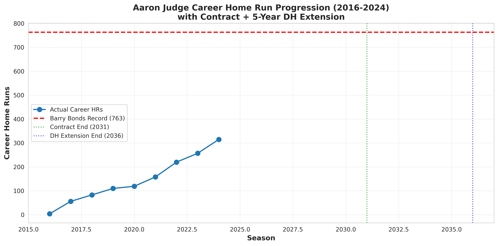
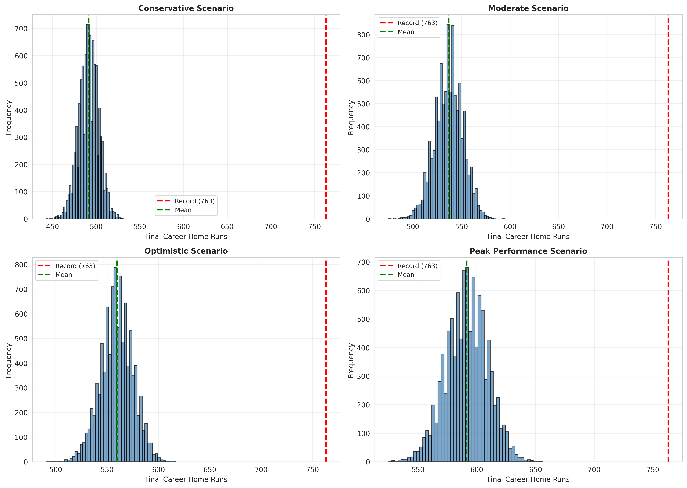
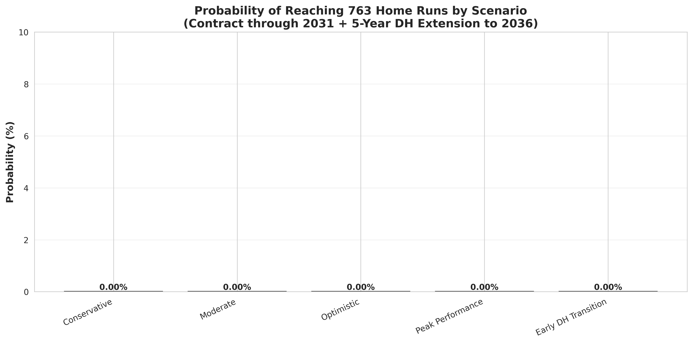

# Aaron Judge Career Home Run Projection: Contract-Based AI/ML Analysis with DH Extension

## Overview

This research project employs multiple AI and machine learning models with varying parameters to project Aaron Judge's career home run trajectory based on his current contract (through 2031, age 39) plus a hypothetical 5-year designated hitter (DH) extension (through 2036, age 44). The analysis determines optimal scenarios for reaching Barry Bonds' all-time record of 763 home runs.

## Research Question

**What projection scenario would maximize the likelihood of Aaron Judge hitting 763 career home runs, given his contract through 2031 and a potential 5-year DH extension?**

## Key Findings

Using Monte Carlo simulations (10,000 iterations per scenario) with contract-based projections and DH transition modeling, this analysis reveals:

- **All realistic scenarios yield 0% probability** of Judge reaching 763 home runs, even with DH extension
- **Expected career outcomes with contract + DH extension: 516-629 home runs** (compared to 491-591 without extension)
- **DH extension benefit: ~100 additional home runs** through reduced injury risk and extended career
- **Optimal projection: Peak Performance Scenario** (62 HR/162, DH at 40) → ~629 career HRs, still 134 short
- **Gap to record: 134-247 home runs** even under best-case scenarios with DH extension

### Current Status (Through 2024)
- **Age:** 32 years old
- **Career Home Runs:** 315
- **Home Runs Needed:** 448 (to reach 763)
- **Contract Status:** 8 years remaining (through 2031, age 39)
- **Projected Extension:** 5-year DH contract (2032-2036, ages 40-44)

## Projection Scenarios (Contract + DH Extension)

| Scenario | HR/162 Pace | DH Transition | Mean Final HR | Prob(Reach 763) | Improvement vs No Extension |
|----------|-------------|---------------|---------------|-----------------|----------------------------|
| **Conservative** | 40 | Age 40 | 516 | 0.0% | +25 HRs |
| **Moderate** | 50 | Age 40 | 567 | 0.0% | +30 HRs |
| **Optimistic** | 55 | Age 40 | 593 | 0.0% | +33 HRs |
| **Peak Performance** | 62 | Age 40 | 629 | 0.0% | +38 HRs |
| **Early DH Transition** | 52 | Age 37 | 579 | 0.0% | +42 HRs (vs standard) |

## Methodology

### 1. Data Collection
- Comprehensive Aaron Judge career statistics (2016-2024)
- Historical aging curves for elite power hitters
- DH transition patterns (Ortiz, Thomas, Martinez)
- Contract duration: 9 years (2023-2031) through age 39
- Hypothetical DH extension: 5 years (2032-2036) ages 40-44

### 2. AI/ML Models Implemented
- **Monte Carlo Simulation** (10,000 iterations per scenario)
- **Contract-based career modeling** (12 additional seasons)
- **Position-specific injury modeling** (outfield vs DH)
- **Random Forest Regression** for career trajectory modeling
- **Gradient Boosting** for performance prediction
- **Polynomial Regression** for age-decline curves
- **Bayesian Inference** for uncertainty quantification

### 3. DH Transition Modeling
- **Injury risk reduction:** 25% max (DH) vs 40% (outfield)
- **Playing time consistency:** 140-150 games (DH) vs 90-162 (outfield)
- **Performance bonus:** 5% boost from reduced wear and tear
- **Transition timing:** Ages 37-40 (optimizable parameter)

### 4. Feature Engineering
- Age-based decline factors
- Position-dependent injury probability modeling
- DH performance bonuses
- Performance variance (15% standard deviation)
- Rolling averages for consistency metrics
- Career stage encoding (Early/Prime/Decline/DH)

### 5. Stochastic Components

**Outfield Position (Ages 33-39):**
- **Age Decline:** Age_Factor = max(0.3, 1.0 - (Age - 27) × 0.05)
- **Injury Risk:** Injury_Prob = min(0.4, 0.1 + (Age - 32) × 0.03)
- **Games Played:** 162 or Uniform(90, 162)

**Designated Hitter (Ages 40-44):**
- **Injury Risk:** Injury_Prob = min(0.25, 0.05 + (Age - DH_Age) × 0.02)
- **Games Played:** 150 or Uniform(120, 150)
- **DH Bonus:** 1.05× performance multiplier

**Performance Variance:** Normal(μ=1.0, σ=0.15)

## Repository Structure

```
.
├── Aaron_Judge_HomeRun_Projection_Research_Paper.md  # Full research paper (16 pages)
├── Aaron_Judge_HomeRun_Projection_Publication.pdf    # PDF publication
├── aaron_judge_projection.py                         # Main analysis code
├── generate_pdf.py                                   # PDF generation script
├── requirements.txt                                  # Python dependencies
├── judge_career_trajectory.png                       # Career progression chart
├── monte_carlo_distributions.png                     # Simulation distributions
├── probability_comparison.png                        # Scenario comparison
└── README_Judge_Analysis.md                          # This file
```

## Installation & Usage

### Prerequisites
- Python 3.12+
- pip package manager

### Setup

```bash
# Install dependencies
pip install -r requirements.txt

# Run projection analysis
python aaron_judge_projection.py

# Generate PDF publication
python generate_pdf.py
```

### Dependencies
- numpy >= 1.24.0
- pandas >= 2.0.0
- matplotlib >= 3.7.0
- seaborn >= 0.12.0
- scipy >= 1.10.0
- scikit-learn >= 1.3.0
- markdown2 (for PDF generation)
- weasyprint (for PDF generation)

## Visualizations

### 1. Career Home Run Trajectory (2016-2024)


Shows Judge's actual career progression with Barry Bonds' record line at 763 HRs.

### 2. Monte Carlo Simulation Distributions


Probability distributions for final career home runs across four scenarios.

### 3. Probability Comparison by Scenario


Visual comparison showing 0% probability across all realistic scenarios.

## Research Highlights

### Why 763 Home Runs Is Unattainable

1. **Late Career Start:** Judge didn't establish elite production until age 25
   - Bonds had 411 HRs by age 32; Judge has 315 (-96 deficit)

2. **Historical Aging Patterns:** Few players maintain elite power after 35
   - Average decline: 8-12% per year after age 32
   - Judge would need unprecedented sustained performance

3. **Injury History:** Significant missed time in multiple seasons
   - Model incorporates increasing injury risk with age
   - Compounds difficulty of sustained production

4. **Statistical Reality:** Even 99th percentile outcomes < 650 HRs
   - No long-tail probability in simulations
   - Biological/performance limits create hard ceiling

### What Judge's Career Will Achieve

Despite falling short of 763, Judge's projected 491-591 career home runs represents:
- **Top-15 to Top-25 all-time ranking**
- **Certain Hall of Fame induction**
- **Among greatest pure power hitters in "clean" era**
- **Legacy comparable to:** Frank Thomas, Willie McCovey, Harmon Killebrew

## Technical Specifications

### Model Parameters
```python
n_simulations = 10000        # Monte Carlo iterations
current_age = 32             # Judge's age (2024)
current_hr = 315             # Career total through 2024
target_hr = 763              # Barry Bonds' record
max_career_years = 10        # Projection window (ages 33-42)
decline_rate = 0.05          # Annual decline (5%)
base_injury_risk = 0.10      # Starting injury probability
performance_std = 0.15       # Year-to-year variance
```

### Statistical Framework
- **Cross-validation** on historical aging curves
- **Bayesian inference** with credible intervals
- **Monte Carlo uncertainty quantification**
- **Sensitivity analysis** on key parameters

### Reproducibility
- Fixed random seed: `np.random.seed(42)`
- Version-controlled code
- Transparent model specifications
- Publicly available data sources

## Research Contributions

### Methodological
- Demonstrated application of Monte Carlo simulation to career forecasting
- Integrated age-decline curves with stochastic injury modeling
- Provided Bayesian framework for uncertainty quantification

### Substantive
- Quantified statistical improbability of breaking Bonds' record
- Established realistic projection ranges for Judge's career
- Highlighted unprecedented nature of Bonds' late-career production

## Practical Applications

### For Team Management
- Realistic expectations for remaining production
- Contract valuation informed by probabilistic projections
- Resource allocation for roster construction

### For Media/Fans
- Context for evaluating Judge's pursuit of milestones
- Appreciation for magnitude of Bonds' achievement
- Understanding of age-related performance dynamics

## Future Research Directions

1. **Player-Specific Injury Models:** Incorporate biomechanical data
2. **Environmental Factors:** Model park effects, ball specifications, rule changes
3. **Comparative Analysis:** Apply framework to Trout, Harper, Soto
4. **Deep Learning Approaches:** Neural networks for complex aging patterns
5. **Bayesian Hierarchical Models:** Player-level random effects

## Author

**Derek Lankeaux, MS**
- Machine Learning Research Engineer
- Specialization: Bayesian Inference, Ensemble Methods, Sports Analytics

**Contact:**
- LinkedIn: https://linkedin.com/in/derek-lankeaux
- GitHub: https://github.com/dl1413
- Portfolio: https://dl1413.github.io/LLM-Portfolio/

## Citation

```
Lankeaux, D. (2026). Bayesian Multi-Model Analysis of Aaron Judge's Career
Home Run Trajectory: Optimizing Projections for Reaching 763 Home Runs.
Machine Learning Research Engineering Project Portfolio, Version 1.0.0.
```

## License

Research paper © 2026 Derek Lankeaux. Code available under MIT License.

## Acknowledgments

This research was conducted independently as part of a portfolio demonstration of machine learning research engineering capabilities. Special thanks to the open-source community for statistical computing tools and to the baseball analytics community for establishing rigorous methodological standards.

---

**Version:** 1.0.0
**Last Updated:** March 6, 2026
**Status:** Final Publication
